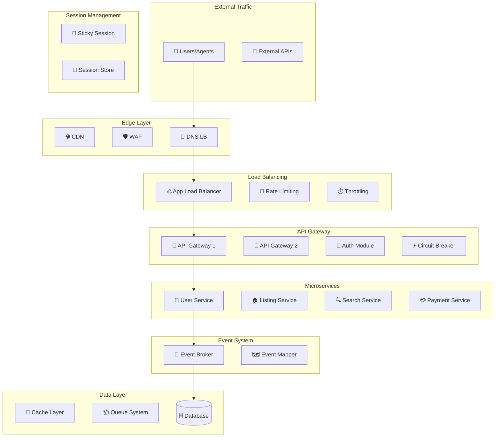
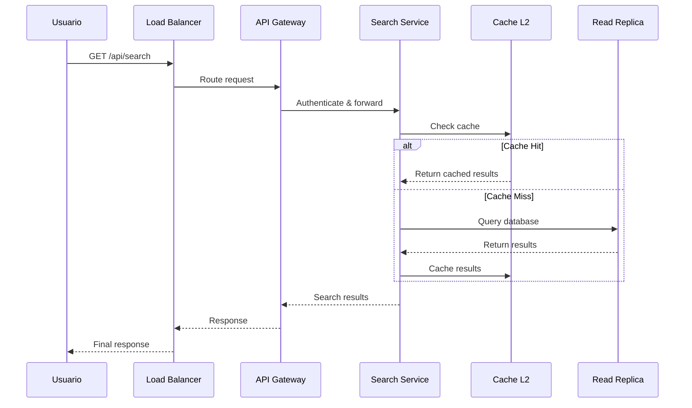
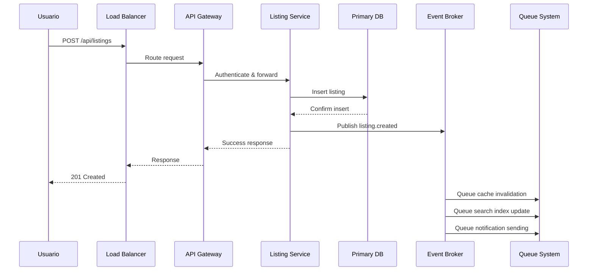

# Arquitectura de Software - Sistema RentaFacil
## Marketplace Inmobiliario de Alta Disponibilidad

**Versión:** 1.0  
**Fecha:** Agosto 2025

---

## **Tabla de Contenidos**

1. [Resumen Ejecutivo](#resumen-ejecutivo)
2. [Principios Arquitecturales](#principios-arquitecturales)
3. [Visión General del Sistema](#visión-general-del-sistema)
4. [Arquitectura por Capas](#arquitectura-por-capas)
5. [Módulos y Servicios Detallados](#módulos-y-servicios-detallados)
6. [Patrones de Diseño Implementados](#patrones-de-diseño-implementados)
7. [Garantías de Disponibilidad](#garantías-de-disponibilidad)
8. [Flujos de Datos](#flujos-de-datos)
9. [Configuración de Despliegue](#configuración-de-despliegue)
10. [Métricas y Monitoreo](#métricas-y-monitoreo)

---

## **Resumen Ejecutivo**

El sistema EasyRent está diseñado como una **arquitectura de microservicios distribuidos** con enfoque en **alta disponibilidad** (99.95% SLA) y **consistencia eventual**. La arquitectura prioriza la disponibilidad del servicio sobre la consistencia estricta, implementando patrones como Circuit Breaker, Event Sourcing y CQRS.

### **Características Clave**
- **Tolerancia a fallos**: Sistema diseñado para continuar operando ante fallos de componentes
- **Escalabilidad horizontal**: Capacidad de agregar recursos según demanda
- **Recuperación automática**: Auto-healing y failover automático
- **Observabilidad completa**: Monitoreo, logging y tracing distribuido
- **Seguridad por capas**: WAF, autenticación, autorización y auditoría

---

## **Principios Arquitecturales**

### **1. Disponibilidad Primero (Availability-First)**
- **Redundancia**: Múltiples instancias de cada componente crítico
- **Degradación gradual**: El sistema continúa funcionando con funcionalidad reducida
- **Failover automático**: Conmutación automática a componentes de respaldo

### **2. Consistencia Eventual**
- **Event Sourcing**: Estados derivados de eventos inmutables
- **Propagación asíncrona**: Cambios propagados vía eventos
- **Compensación**: Mecanismos de rollback distribuido

### **3. Responsabilidad Única**
- **Microservicios especializados**: Cada servicio tiene una responsabilidad específica
- **Separación de contextos**: Bounded contexts bien definidos
- **APIs cohesivas**: Interfaces bien definidas entre servicios

### **4. Observabilidad Total**
- **Telemetría**: Métricas, logs y trazas en tiempo real
- **Alertas proactivas**: Detección temprana de problemas
- **Dashboards en tiempo real**: Visibilidad completa del sistema

---

## **Visión General del Sistema**



---

## **Arquitectura por Capas**

### **Capa 1: Edge Layer (Borde de Red)**
**Propósito:** Primera línea de defensa y optimización de contenido

#### **Módulos:**
- **CDN (Content Delivery Network)**
- **WAF (Web Application Firewall)**
- **DNS Load Balancer**

#### **Responsabilidades:**
- Distribución global de contenido estático
- Protección contra ataques DDoS y malware
- Balanceo de carga geográfico
- Terminación SSL/TLS

---

### **Capa 2: Load Balancing & Traffic Management**
**Propósito:** Distribución inteligente del tráfico y control de flujo

#### **Módulos:**
- **Application Load Balancer (ALB)**
- **Rate Limiting Module**
- **Throttling Module**
- **Geo Routing Module**

#### **Responsabilidades:**
- Distribución de carga entre instancias
- Limitación de tasa de requests por cliente
- Control de throttling por plan de usuario
- Ruteo basado en geolocalización

---

### **Capa 3: API Gateway Layer**
**Propósito:** Punto de entrada unificado y control de acceso

#### **Módulos:**
- **API Gateway Cluster (Kong/Ambassador)**
- **Authentication Module**
- **Circuit Breaker Module**
- **Retry Module**

#### **Responsabilidades:**
- Autenticación y autorización centralizada
- Protección contra fallos en cascade
- Reintentos inteligentes con backoff exponencial
- Transformación de requests/responses

---

### **Capa 4: Session Management Layer**
**Propósito:** Gestión de sesiones y afinidad de servidor

#### **Módulos:**
- **Sticky Session Module**
- **Session Store (Redis Cluster)**
- **Session Load Balancer**

#### **Responsabilidades:**
- Afinidad de sesión con failover
- Almacenamiento distribuido de sesiones
- Balanceo consistente de sesiones
- Recuperación automática ante fallos

---

### **Capa 5: Application Layer - Microservices**
**Propósito:** Lógica de negocio distribuida

#### **Core Services Clusters:**
- **User Service Cluster (A, B, C)**
- **Listing Service Cluster (A, B, C)**
- **Search Service Cluster (A, B, C)**

#### **Business Services:**
- **Payment Service**
- **Notification Service**
- **Analytics Service**
- **Media Service**

#### **Responsabilidades:**
- Procesamiento de lógica de negocio
- Validación de datos y reglas
- Integración con servicios externos
- Manejo de transacciones distribuidas

---

### **Capa 6: Event-Driven Architecture**
**Propósito:** Comunicación asíncrona y consistencia eventual

#### **Módulos:**
- **Event Broker Cluster (Apache Kafka)**
- **Event Router Module**
- **Event Mapper Module**
- **Dead Letter Module**

#### **Responsabilidades:**
- Publicación y suscripción de eventos
- Ruteo inteligente de eventos
- Mapeo y transformación de esquemas
- Manejo de eventos fallidos

---

### **Capa 7: Caching Layer**
**Propósito:** Optimización de rendimiento multi-nivel

#### **Módulos:**
- **L1 Cache Module (In-Memory)**
- **L2 Cache Module (Redis Cluster)**
- **L3 Cache Module (Distributed)**
- **Cache Invalidation Module**
- **Cache Warming Module**

#### **Responsabilidades:**
- Cache local para datos frecuentes
- Cache distribuido para compartir entre instancias
- Cache persistente para datos estáticos
- Invalidación inteligente de cache
- Pre-carga proactiva de datos

---

### **Capa 8: Queue Management System**
**Propósito:** Procesamiento asíncrono y tolerancia a fallos

#### **Módulos:**
- **Priority Queue Module**
- **Retry Queue Module**
- **Batch Processing Module**
- **Queue Workers (1, 2, 3)**

#### **Responsabilidades:**
- Cola de prioridades para tareas críticas
- Reintentos automáticos con backoff
- Procesamiento por lotes para eficiencia
- Workers distribuidos para procesamiento

---

### **Capa 9: Data Layer**
**Propósito:** Persistencia y acceso a datos

#### **Módulos:**
- **PostgreSQL Primary**
- **Read Replicas (1, 2, 3)**
- **Connection Pool Module (PgBouncer)**
- **Query Router Module**
- **DB Circuit Breaker Module**

#### **Responsabilidades:**
- Almacenamiento principal de datos
- Réplicas de lectura para escalabilidad
- Pool de conexiones para eficiencia
- Ruteo de queries read/write
- Protección contra fallos de BD

---

### **Capa 10: Monitoring & Observability**
**Propósito:** Visibilidad y alertas del sistema

#### **Módulos:**
- **Health Check Module**
- **Metrics Collection Module**
- **Centralized Logging Module**
- **Distributed Tracing Module**
- **Alert Manager Module**
- **SLA Monitoring Module**
- **Anomaly Detection Module**

#### **Responsabilidades:**
- Verificación de salud de servicios
- Recolección de métricas de rendimiento
- Agregación centralizada de logs
- Trazabilidad de requests distribuidos
- Gestión y escalado de alertas
- Monitoreo de SLAs y KPIs
- Detección automática de anomalías

---

## **Módulos y Servicios Detallados**

### **Rate Limiting Module**

**Propósito:** Controlar la tasa de requests para prevenir abuso y garantizar QoS

**Características:**
- **Algoritmo:** Sliding Window con Redis
- **Granularidad:** Por IP, Usuario, API Key
- **Límites configurables:** Por endpoint y plan de usuario
- **Respuesta:** HTTP 429 con Retry-After header

**Configuración:**
```yaml
rate_limits:
  global: 1000/hour
  authenticated: 5000/hour
  search_api: 100/minute
  upload_api: 10/minute
```

**Métricas:**
- Requests bloqueados por rate limiting
- Distribución de tasa de requests
- Top usuarios por consumo

---

### **Throttling Module**

**Propósito:** Gestión de recursos basada en planes de suscripción

**Características:**
- **Algoritmo:** Token Bucket distribuido
- **Diferenciación:** Por plan (Free, Basic, Premium, Enterprise)
- **Recursos controlados:** CPU, Memoria, Ancho de banda
- **Degradación gradual:** Reducción de QoS antes del bloqueo

**Límites por Plan:**
```yaml
throttling:
  free:
    requests_per_hour: 100
    concurrent_searches: 2
    max_images_upload: 3
  premium:
    requests_per_hour: 10000
    concurrent_searches: 20
    max_images_upload: 15
```

**Métricas:**
- Utilización por plan
- Requests throttled por usuario
- Distribución de carga por plan

---

### **Sticky Session Module**

**Propósito:** Mantener afinidad usuario-servidor para mejor experiencia

**Características:**
- **Algoritmo:** Consistent Hashing con failover
- **Persistencia:** Redis con TTL configurable
- **Recuperación:** Reasignación automática ante fallos
- **Balanceo:** Redistribución periódica para balance

**Configuración:**
```yaml
sticky_sessions:
  ttl: 3600  # 1 hora
  hash_algorithm: sha256
  failover_enabled: true
  rebalance_interval: 300  # 5 minutos
```

**Métricas:**
- Distribución de sesiones por servidor
- Tasa de reasignaciones por fallo
- Tiempo promedio de sesión

---

### **Circuit Breaker Module**

**Propósito:** Prevenir fallos en cascada y degradación del sistema

**Características:**
- **Estados:** Closed, Open, Half-Open
- **Umbrales configurables:** Por servicio
- **Fallbacks:** Respuestas por defecto o cache
- **Recuperación gradual:** Testing automático

**Configuración por Servicio:**
```yaml
circuit_breakers:
  user_service:
    error_threshold: 50%
    timeout: 3000ms
    reset_timeout: 30000ms
    volume_threshold: 10
  payment_service:
    error_threshold: 30%
    timeout: 5000ms
    reset_timeout: 60000ms
    volume_threshold: 5
```

**Métricas:**
- Estado actual de cada circuit breaker
- Tasa de ejecución de fallbacks
- Tiempo de recuperación promedio

---

### **Event Broker Module (Apache Kafka)**

**Propósito:** Comunicación asíncrona y garantía de entrega de eventos

**Características:**
- **Particionado:** Por aggregate ID para orden
- **Replicación:** Factor 3 con min in-sync 2
- **Retención:** Configurable por topic
- **Schemas:** Registry centralizado para evolución

**Topics Principales:**
```yaml
topics:
  user.events:
    partitions: 6
    replication_factor: 3
    retention: 7days
  listing.events:
    partitions: 12
    replication_factor: 3
    retention: 30days
  payment.events:
    partitions: 3
    replication_factor: 3
    retention: 1year
```

**Métricas:**
- Throughput por topic
- Lag de consumers
- Errores de serialización

---

### **Event Mapper Module**

**Propósito:** Transformación y ruteo inteligente de eventos

**Características:**
- **Schema Registry:** Versionado de esquemas
- **Transformaciones:** Mapeo entre versiones
- **Filtrado:** Ruteo condicional
- **Enriquecimiento:** Agregado de metadatos

**Configuración:**
```yaml
event_mapping:
  user.created:
    target_services: [notification, analytics, crm]
    transformations:
      - add_timestamp
      - enrich_geolocation
      - anonymize_pii
  listing.published:
    target_services: [search, analytics, recommendation]
    filters:
      - status: active
      - verified: true
```

**Métricas:**
- Eventos transformados por tipo
- Errores de mapeo
- Latencia de transformación

---

### **Health Check Module**

**Propósito:** Monitoreo proactivo de salud de servicios

**Características:**
- **Checks personalizados:** Por servicio
- **Umbrales configurables:** Healthy/Unhealthy
- **Acciones automáticas:** Remove from LB, alerts
- **Dependency checks:** Verificación de dependencias

**Configuración:**
```yaml
health_checks:
  user_service:
    endpoint: /health
    interval: 30s
    timeout: 5s
    unhealthy_threshold: 3
    healthy_threshold: 2
    dependencies: [postgres, redis]
  listing_service:
    endpoint: /health
    interval: 15s
    timeout: 3s
    unhealthy_threshold: 2
    healthy_threshold: 1
    dependencies: [postgres, kafka, s3]
```

**Acciones Automáticas:**
- Remover del load balancer
- Abrir circuit breaker
- Enviar alertas críticas
- Escalar instancias adicionales

---

## **Patrones de Diseño Implementados**

### **1. Circuit Breaker Pattern**
**Implementación:** Hystrix/Resilience4j  
**Propósito:** Prevenir fallos en cascada  
**Ubicación:** API Gateway y Service-to-Service calls

### **2. Retry Pattern con Exponential Backoff**
**Implementación:** Custom middleware  
**Propósito:** Recuperación automática de errores transitorios  
**Configuración:** Max 5 reintentos, backoff 2^n segundos

### **3. Bulkhead Pattern**
**Implementación:** Resource isolation  
**Propósito:** Aislar recursos para prevenir contención  
**Aplicación:** Connection pools, thread pools separados

### **4. Event Sourcing Pattern**
**Implementación:** Kafka + Event Store  
**Propósito:** Auditabilidad y reconstrucción de estado  
**Aplicación:** Eventos de usuario, transacciones, cambios críticos

### **5. CQRS Pattern**
**Implementación:** Separate read/write models  
**Propósito:** Optimización de consultas y comandos  
**Aplicación:** Search service con índices especializados

### **6. Saga Pattern**
**Implementación:** Choreography-based  
**Propósito:** Transacciones distribuidas  
**Aplicación:** Proceso de pago, verificación de listings

---

## **Garantías de Disponibilidad**

### **SLA Objetivos**

| Componente | Disponibilidad | RTO | RPO | Técnicas |
|------------|---------------|-----|-----|----------|
| **Sistema Global** | 99.95% | 5 min | 1 min | Multi-AZ, Auto-scaling |
| **API Gateway** | 99.99% | 2 min | 0 | Load balancing, Health checks |
| **Base de Datos** | 99.9% | 10 min | 5 min | Streaming replication |
| **Cache Layer** | 99.99% | 1 min | 0 | Redis Cluster, Fallback |
| **Event System** | 99.95% | 3 min | 1 min | Kafka cluster, Retention |

### **Estrategias de Recuperación**

#### **Recuperación Automática (Auto-Healing)**
- **Health checks** cada 30 segundos
- **Restart automático** de contenedores fallidos
- **Rebalanceo automático** de carga
- **Escalado reactivo** basado en métricas

#### **Recuperación Manual (Disaster Recovery)**
- **Backup completo** diario + WAL continuo
- **Réplicas cross-region** para geo-redundancia
- **Runbooks automatizados** para incidentes comunes
- **War room virtual** con escalado automático

---

## **Flujos de Datos**

### **Flujo de Lectura (Search Listings)**


### **Flujo de Escritura (Create Listing)**


---

## **Configuración de Despliegue**

### **Kubernetes Deployment**

```yaml
apiVersion: apps/v1
kind: Deployment
metadata:
  name: user-service
spec:
  replicas: 3
  selector:
    matchLabels:
      app: user-service
  template:
    metadata:
      labels:
        app: user-service
    spec:
      containers:
      - name: user-service
        image: easyrent/user-service:latest
        resources:
          requests:
            memory: "256Mi"
            cpu: "250m"
          limits:
            memory: "512Mi"
            cpu: "500m"
        livenessProbe:
          httpGet:
            path: /health
            port: 3000
          initialDelaySeconds: 30
          periodSeconds: 10
        readinessProbe:
          httpGet:
            path: /ready
            port: 3000
          initialDelaySeconds: 5
          periodSeconds: 5
        env:
        - name: DB_HOST
          value: "pgbouncer"
        - name: REDIS_HOST
          value: "redis-cluster"
        - name: KAFKA_BROKERS
          value: "kafka-1:9092,kafka-2:9092,kafka-3:9092"
```

### **Docker Compose para Desarrollo**

```yaml
version: '3.8'
services:
  nginx:
    image: nginx:alpine
    ports: ["80:80"]
    volumes: ["./nginx.conf:/etc/nginx/nginx.conf"]
    depends_on: [user-service, listing-service, search-service]
    
  user-service:
    build: ./services/user
    deploy:
      replicas: 2
    environment:
      DB_HOST: postgres
      REDIS_HOST: redis
      KAFKA_BROKERS: kafka:9092
    depends_on: [postgres, redis, kafka]
    
  postgres:
    image: postgres:17
    environment:
      POSTGRES_DB: easyrent
      POSTGRES_USER: postgres
      POSTGRES_PASSWORD: password
    volumes:
      - postgres_data:/var/lib/postgresql/data
      
  redis:
    image: redis:7-alpine
    command: redis-server --maxmemory 1gb --maxmemory-policy allkeys-lru
    
  kafka:
    image: confluentinc/cp-kafka:latest
    environment:
      KAFKA_ZOOKEEPER_CONNECT: zookeeper:2181
      KAFKA_LISTENERS: PLAINTEXT://0.0.0.0:9092
      KAFKA_ADVERTISED_LISTENERS: PLAINTEXT://kafka:9092
    depends_on: [zookeeper]
```

---

## **Métricas y Monitoreo**

### **Métricas de Infraestructura**
- **CPU Usage**: Por servicio y nodo
- **Memory Usage**: Heap, stack, cache
- **Network I/O**: Throughput, latencia, errores
- **Disk I/O**: IOPS, latencia, espacio libre

### **Métricas de Aplicación**
- **Request Rate**: RPS por endpoint
- **Response Time**: P50, P95, P99
- **Error Rate**: 4xx, 5xx por servicio
- **Throughput**: Transacciones por segundo

### **Métricas de Negocio**
- **User Activity**: Registros, logins, búsquedas
- **Listing Activity**: Publicaciones, visualizaciones, leads
- **Payment Activity**: Transacciones, fallos, ingresos
- **Conversion Rates**: Funnel de conversión completo

### **Alertas Críticas**
```yaml
alerts:
  - name: HighErrorRate
    condition: error_rate > 5%
    duration: 2m
    severity: critical
    
  - name: HighLatency
    condition: p95_latency > 2s
    duration: 5m
    severity: warning
    
  - name: DatabaseDown
    condition: postgres_up == 0
    duration: 30s
    severity: critical
    
  - name: LowCacheHitRate
    condition: cache_hit_rate < 80%
    duration: 10m
    severity: warning
```

### **Dashboards**
- **Operations Dashboard**: Estado general del sistema
- **Business Dashboard**: KPIs de negocio en tiempo real  
- **Performance Dashboard**: Métricas de rendimiento detalladas
- **Security Dashboard**: Eventos de seguridad y amenazas

---

## **Próximos Pasos**

### **Fase 1: Implementación Core (Mes 1-2)**
- [ ] Setup de infraestructura base
- [ ] Implementación de servicios core
- [ ] Configuración de monitoreo básico

### **Fase 2: Alta Disponibilidad (Mes 3-4)**
- [ ] Implementación de circuit breakers
- [ ] Setup de replicación de datos
- [ ] Configuración de alertas avanzadas

### **Fase 3: Optimización (Mes 5-6)**
- [ ] Implementación de cache distribuido
- [ ] Optimización de consultas
- [ ] Tuning de rendimiento

### **Fase 4: Producción (Mes 7+)**
- [ ] Deploy en múltiples regiones
- [ ] Setup de disaster recovery
- [ ] Monitoreo y mejora continua

---

**Documento actualizado:** Agosto 2025  
**Próxima revisión:** Septiembre 2025  
**Responsable:** Equipo de Arquitectura - Inmobiliaria Benites
