# Diagrama Entidad-Relación

## Esquema General de la Base de Datos

```mermaid
erDiagram
    %% Core Entities
    USERS {
        uuid id PK
        citext email UK
        text password_hash
        text first_name
        text last_name
        text phone
        core_user_role role
        boolean email_verified
        timestamptz created_at
        timestamptz updated_at
    }
    
    AGENCIES {
        uuid id PK
        text name
        citext email
        text phone
        text website
        text address
        text description
        text logo_url
        boolean is_verified
        timestamptz created_at
        timestamptz updated_at
    }
    
    USER_AGENCY {
        uuid user_id PK,FK
        uuid agency_id PK,FK
    }
    
    %% Listings (Partitioned)
    LISTINGS {
        uuid id PK
        timestamptz created_at PK
        uuid owner_user_id FK
        uuid agency_id FK
        core_listing_status status
        core_operation_type operation
        core_property_type property_type
        text title
        text description
        numeric price
        char currency
        smallint bedrooms
        smallint bathrooms
        smallint parking_spaces
        numeric area_m2
        smallint year_built
        text address
        text district
        text province
        text country
        numeric latitude
        numeric longitude
        core_verification_status verification_status
        boolean is_featured
        boolean is_premium
        timestamptz published_at
        timestamptz expires_at
        timestamptz updated_at
        tsvector search_doc
        text slug UK
    }
    
    LISTING_IMAGES {
        uuid id PK
        uuid listing_id FK
        timestamptz listing_created_at FK
        text image_url
        text alt_text
        integer display_order
        boolean is_primary
        timestamptz created_at
    }
    
    LISTING_VIDEOS {
        uuid id PK
        uuid listing_id FK
        timestamptz listing_created_at FK
        text video_url
        text title
        integer duration_seconds
        timestamptz created_at
    }
    
    %% Amenities
    AMENITIES {
        serial id PK
        text name UK
        text icon
    }
    
    LISTING_AMENITIES {
        uuid listing_id PK,FK
        timestamptz listing_created_at PK,FK
        integer amenity_id PK,FK
    }
    
    %% User Interactions (Partitioned)
    LEADS {
        uuid id PK
        timestamptz created_at PK
        uuid listing_id FK
        timestamptz listing_created_at FK
        uuid user_id FK
        text contact_name
        text contact_phone
        citext email
        text message
        text utm_source
        text utm_medium
        text utm_campaign
        text utm_term
        text utm_content
    }
    
    FAVORITES {
        uuid user_id PK,FK
        uuid listing_id PK,FK
        timestamptz listing_created_at PK,FK
        timestamptz created_at
    }
    
    SEARCH_ALERTS {
        uuid id PK
        uuid user_id FK
        text name
        jsonb search_criteria
        text frequency
        boolean is_active
        timestamptz last_run
        timestamptz created_at
    }
    
    %% Analytics (Partitioned)
    EVENTS {
        uuid id PK
        timestamptz created_at PK
        uuid user_id FK
        text session_id
        text event_type
        uuid listing_id FK
        timestamptz listing_created_at FK
        jsonb properties
        inet ip_address
        text user_agent
    }
    
    %% Moderation (Partitioned)
    VERIFICATIONS {
        uuid id PK
        timestamptz created_at PK
        uuid listing_id FK
        timestamptz listing_created_at FK
        moderation_verification_status status
        uuid assigned_to FK
        text rejection_reason
        text notes
        timestamptz updated_at
    }
    
    %% Security & Audit
    AUDIT_LOG {
        uuid id PK
        uuid user_id FK
        text action
        text table_name
        uuid record_id
        jsonb old_values
        jsonb new_values
        inet ip_address
        text user_agent
        timestamptz created_at
    }
    
    USER_SESSIONS {
        uuid id PK
        uuid user_id FK
        text token_hash UK
        inet ip_address
        text user_agent
        timestamptz last_activity
        timestamptz expires_at
        timestamptz created_at
        timestamptz revoked_at
    }
    
    USER_CONSENTS {
        uuid id PK
        uuid user_id FK
        text purpose
        boolean granted
        timestamptz granted_at
        timestamptz withdrawn_at
        inet ip_address
        text user_agent
    }
    
    FAILED_LOGINS {
        uuid id PK
        citext email
        inet ip_address
        text user_agent
        text failure_reason
        timestamptz created_at
    }
    
    %% Subscriptions & Billing
    PLANS {
        uuid id PK
        text code UK
        text name
        text description
        text tier
        smallint period_months
        numeric price_amount
        char price_currency
        integer max_active_listings
        integer listing_active_days
        integer max_images_per_listing
        integer max_videos_per_listing
        integer max_video_seconds
        boolean is_active
        timestamptz created_at
        timestamptz updated_at
    }
    
    SUBSCRIPTIONS {
        uuid id PK
        uuid user_id FK
        uuid plan_id FK
        core_subscription_status status
        timestamptz starts_at
        timestamptz ends_at
        timestamptz canceled_at
        timestamptz created_at
        timestamptz updated_at
    }
    
    INVOICES {
        uuid id PK
        text number UK
        uuid user_id FK
        uuid subscription_id FK
        uuid plan_id FK
        char currency
        numeric amount_due
        numeric tax_amount
        numeric discount_amount
        numeric amount_paid
        core_invoice_status status
        uuid tax_rate_id FK
        uuid coupon_id FK
        timestamptz issued_at
        timestamptz due_at
        timestamptz paid_at
        timestamptz created_at
        timestamptz updated_at
    }
    
    PAYMENTS {
        uuid id PK
        uuid invoice_id FK
        uuid user_id FK
        char currency
        numeric amount
        core_payment_status status
        core_billing_provider provider
        text provider_payment_id
        jsonb provider_data
        text failure_reason
        timestamptz processed_at
        timestamptz created_at
        timestamptz updated_at
    }

    %% Relationships with composite FKs for partitioned tables
    USERS ||--o{ USER_AGENCY : "belongs to"
    AGENCIES ||--o{ USER_AGENCY : "has members"
    
    USERS ||--o{ LISTINGS : "owns"
    AGENCIES ||--o{ LISTINGS : "manages"
    
    LISTINGS ||--o{ LISTING_IMAGES : "has (composite FK)"
    LISTINGS ||--o{ LISTING_VIDEOS : "has (composite FK)"
    LISTINGS ||--o{ LISTING_AMENITIES : "has (composite FK)"
    AMENITIES ||--o{ LISTING_AMENITIES : "belongs to"
    
    USERS ||--o{ LEADS : "generates"
    LISTINGS ||--o{ LEADS : "receives (composite FK)"
    
    USERS ||--o{ FAVORITES : "marks"
    LISTINGS ||--o{ FAVORITES : "favorited by (composite FK)"
    
    USERS ||--o{ SEARCH_ALERTS : "creates"
    
    USERS ||--o{ EVENTS : "generates"
    LISTINGS ||--o{ EVENTS : "subject of (composite FK)"
    
    LISTINGS ||--o{ VERIFICATIONS : "verified by (composite FK)"
    USERS ||--o{ VERIFICATIONS : "assigned to"
    
    USERS ||--o{ AUDIT_LOG : "actions by"
    USERS ||--o{ USER_SESSIONS : "has"
    USERS ||--o{ USER_CONSENTS : "grants"
    
    USERS ||--o{ SUBSCRIPTIONS : "subscribes to"
    PLANS ||--o{ SUBSCRIPTIONS : "basis for"
    
    USERS ||--o{ INVOICES : "billed to"
    SUBSCRIPTIONS ||--o{ INVOICES : "generates"
    PLANS ||--o{ INVOICES : "for plan"
    
    INVOICES ||--o{ PAYMENTS : "paid by"
    USERS ||--o{ PAYMENTS : "made by"
    
```



## Tablas Particionadas

### Particionado por fecha (RANGE)
Las siguientes tablas están particionadas mensualmente por `created_at`:

- **core.listings**: PRIMARY KEY (id, created_at)
- **core.leads**: PRIMARY KEY (id, created_at)  
- **analytics.events**: PRIMARY KEY (id, created_at)
- **moderation.verifications**: PRIMARY KEY (id, created_at)

### Estrategia de particionado
```sql
-- Ejemplo: Particiones de listings por mes
core.listings_2025_01  -- Enero 2025
core.listings_2025_02  -- Febrero 2025
core.listings_2025_03  -- Marzo 2025
-- ... etc
```

## Foreign Keys Compuestas

### Requisito PostgreSQL 17.x
Todas las referencias a tablas particionadas requieren FK compuestas:

```sql
-- Patrón para FK a tablas particionadas
FOREIGN KEY (listing_id, listing_created_at) 
REFERENCES core.listings (id, created_at)
```

### Tablas con FK Compuestas
- **core.listing_images**: (listing_id, listing_created_at)
- **core.listing_videos**: (listing_id, listing_created_at) 
- **core.listing_amenities**: (listing_id, listing_created_at)
- **core.leads**: (listing_id, listing_created_at)
- **core.favorites**: (listing_id, listing_created_at)
- **analytics.events**: (listing_id, listing_created_at) - referencia
- **moderation.verifications**: (listing_id, listing_created_at)

## Índices Principales

### Core Tables
- **listings**: (status, verification_status, published_at), (operation, property_type, price), GIN(search_doc)
- **users**: (email), (role), (email_verified)
- **agencies**: (name), (email), (is_verified)

### Analytics & Performance
- **events**: (user_id, created_at), (event_type, created_at), (listing_id, listing_created_at)
- **leads**: (listing_id, listing_created_at), (email), (contact_phone)

### Security
- **audit_log**: (user_id, created_at), (table_name, record_id)
- **user_sessions**: (user_id, expires_at), (token_hash)

## Vistas Materializadas

### Analytics
- **mv_price_m2_90d**: Precios promedio por m² últimos 90 días
- **mv_leads_daily**: Leads diarios por distrito

### Performance
- Actualización programada cada hora
- Índices específicos para consultas frecuentes
- Refresh concurrente para evitar bloqueos

## Consideraciones de Seguridad

### Datos Personales (Ley 29733)
- Consentimientos granulares por propósito
- Derecho al olvido implementado
- Auditoría completa de accesos

### Autenticación
- Sesiones con tokens hash seguros
- Tracking de dispositivos
- Auto-expiración configurable

### Monitoring
- Log de intentos fallidos de login
- Alertas por actividad sospechosa
- Backup automático de audit logs
